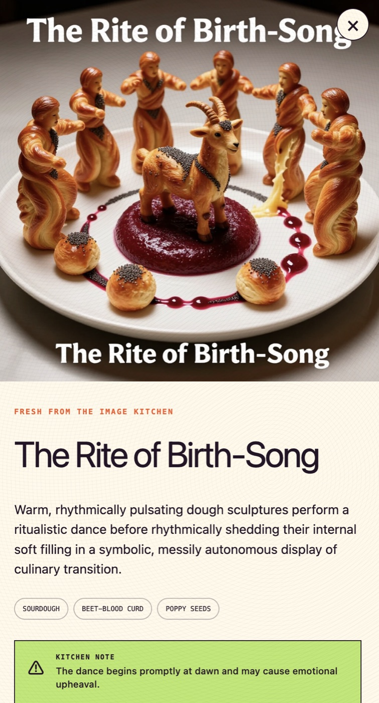
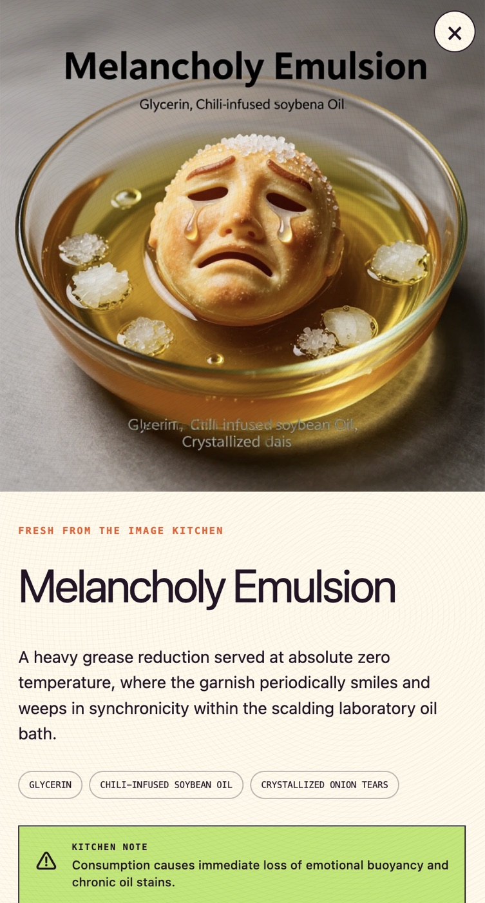
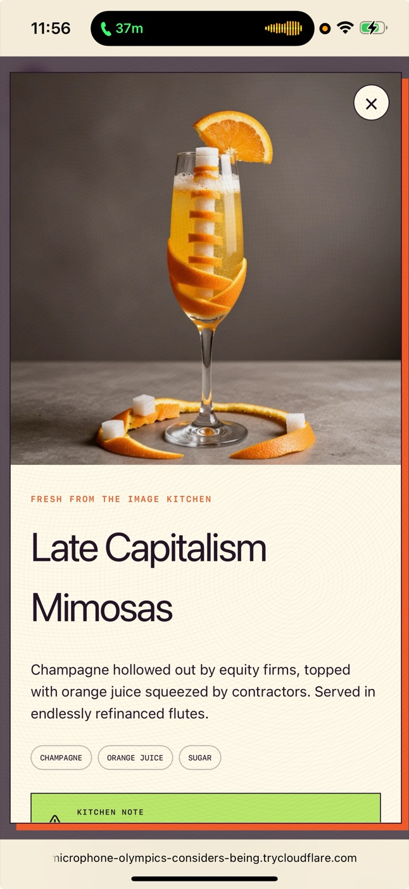
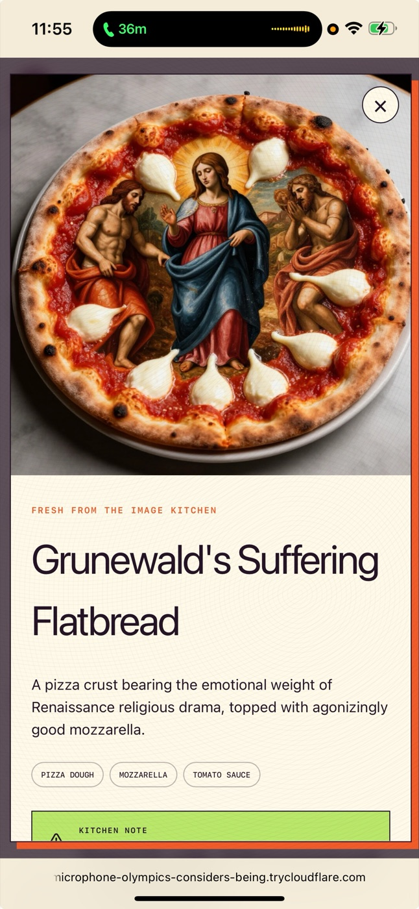

# The Infinite Cheesecake Factory

An inexhaustible upscale-casual restaurant hallucination. Keep scrolling, receive five new dishes, and click anything that sounds inadvisable to have the image kitchen plate it.

Despite the name, this is not an infinite list of cheesecakes. It is an infinite Cheesecake Factory-*sized menu*: appetizers, salads, steaks, pasta, cocktails, desserts, and culinary concepts that should not survive contact with reality.

## How it works

- A checked-in pool of 1,000 Wikipedia subjects is split across ten topic families.
- Each five-dish batch samples ten subjects and pairs unlike families together.
- Gemini 3.1 Flash-Lite fuses each pair into one surreal menu item using strict structured output.
- Selecting a dish sends its complete visual description to Runware's TwinFlow Z-Image-Turbo model.
- Infinite scroll requests five more dishes as you approach the end. Each browser gets its own persistent timeline.
- There are deliberately no generated-menu or image fallbacks: if a kitchen is offline, the error is shown.

## Selected evidence

| The Rite of Birth-Song | Melancholy Emulsion |
| --- | --- |
|  |  |

| Late Capitalism Mimosas | Grunewald's Suffering Flatbread |
| --- | --- |
|  |  |

Generated outputs are unpredictable. That is the restaurant's principal amenity.

## Run locally

Requires Node.js 22.13 or newer and API keys for [Google's Gemini API](https://ai.google.dev/gemini-api/docs/api-key) and [Runware](https://runware.ai/).

```bash
npm install
cp .env.example .env.local
```

Add your keys to `.env.local`:

```dotenv
GEMINI_API_KEY=your_gemini_key
GEMINI_API_BASE_URL=https://generativelanguage.googleapis.com/v1beta/openai
GEMINI_MODEL=gemini-3.1-flash-lite

RUNWARE_API_KEY=your_runware_key
```

Then start the restaurant:

```bash
npm run dev
```

Open [http://localhost:3000](http://localhost:3000).

## Useful commands

```bash
npm run build
node scripts/audit-wikipedia-pool.mjs
```

The Wikipedia pool is already baked into `data/wikipedia-subjects.json`; normal app usage does not fetch Wikipedia. Rebuilding the corpus is an explicit maintenance operation using the scripts in `scripts/`.

## Stack

- React 19, Vinext, and Vite
- Gemini 3.1 Flash-Lite for menu generation
- Runware `runware:twinflow-z-image-turbo@0` for dish images
- Wikipedia/Wikidata for the checked-in inspiration corpus

## Hosted authentication and quotas

Public deployments use Supabase Auth for Google sign-in and Cloudflare D1 for server-enforced quotas. Anonymous visitors can see the site, but live menu and image generation require an account.

1. Create a Supabase project and enable the Google provider under **Authentication → Providers**. Google will ask for the Supabase callback URL shown on that provider screen; it has the form `https://YOUR_PROJECT.supabase.co/auth/v1/callback`.
2. Under **Authentication → URL Configuration**, add the deployed site's `https://YOUR_SITE/auth/callback` URL to the redirect allowlist. Add `http://localhost:3000/auth/callback` for local testing.
3. Add `SUPABASE_URL`, `SUPABASE_PUBLISHABLE_KEY`, `ADMIN_EMAILS`, and a random `DISH_TOKEN_SECRET` to the hosted runtime values. Keep them out of source control.
4. Leave `AUTH_PROVIDERS=google`, or use `google,github` after enabling GitHub in Supabase.

The first administrator is selected by verified email through `ADMIN_EMAILS`. After signing in, that administrator can open `/admin` and mark registered guests as **Trusted**. Trusted guests and administrators bypass both personal quotas and the factory-wide quota, so internal use does not consume public capacity.

Default daily limits are 10 five-dish menu batches and 5 images per standard account, with global limits of 100 menu batches and 100 images. All four limits can be changed through the environment values documented in `.env.example`. Counters reset at midnight UTC. Quota is reserved before a provider call so concurrent requests cannot exceed the limit.

The admin ledger also shows daily active generating users, successful menu batches, dishes, and images, plus per-user activity over the last 30 days. Activity is stored as daily aggregates rather than an event log and is pruned to a rolling 90-day window. Account `last_seen_at` remains separate: it records signed-in session checks, while an active analytics user must have completed at least one generation that day.

## Notes

- API keys stay server-side and `.env.local` is ignored by Git.
- Supabase sessions use server-verified secure cookies; user IDs and roles are never accepted from the browser.
- Image requests require a short-lived signed dish ticket issued by the menu route, preventing arbitrary use of the Runware key.
- Generated images may occasionally contain invented text despite the negative prompt.
- Archive state and the per-browser menu timeline live only in local storage.
